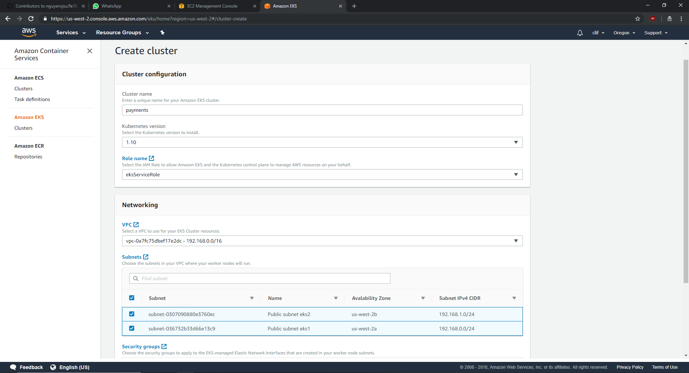
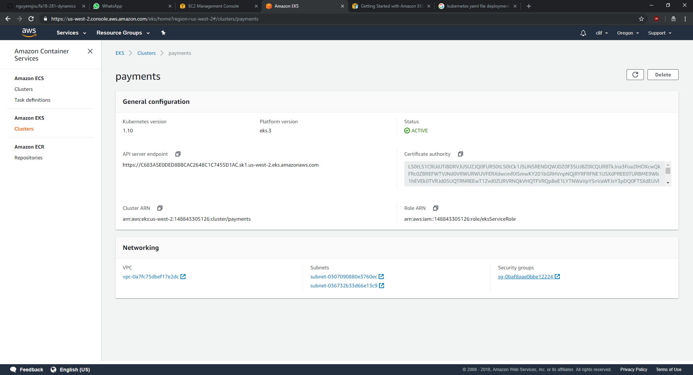
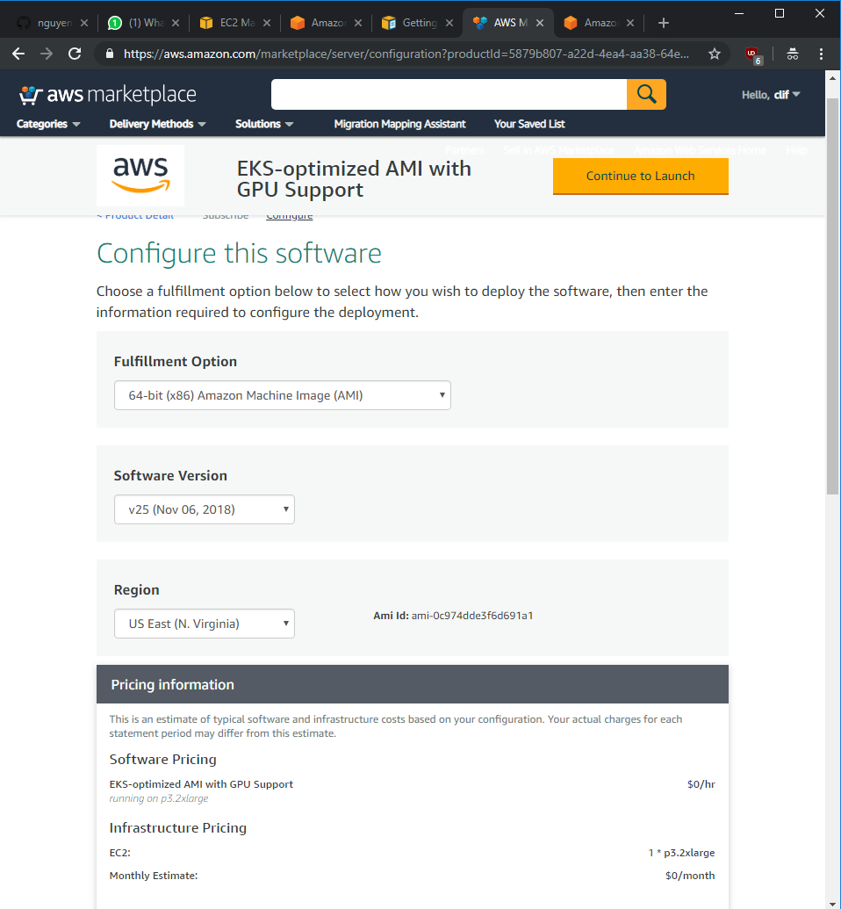
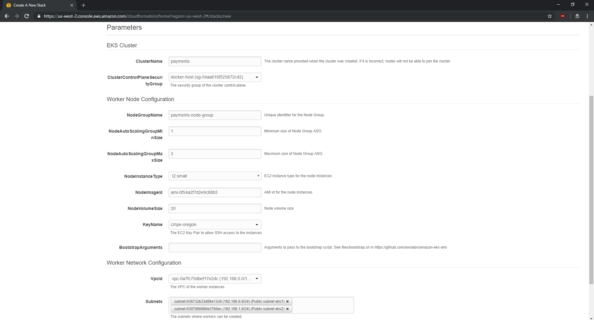
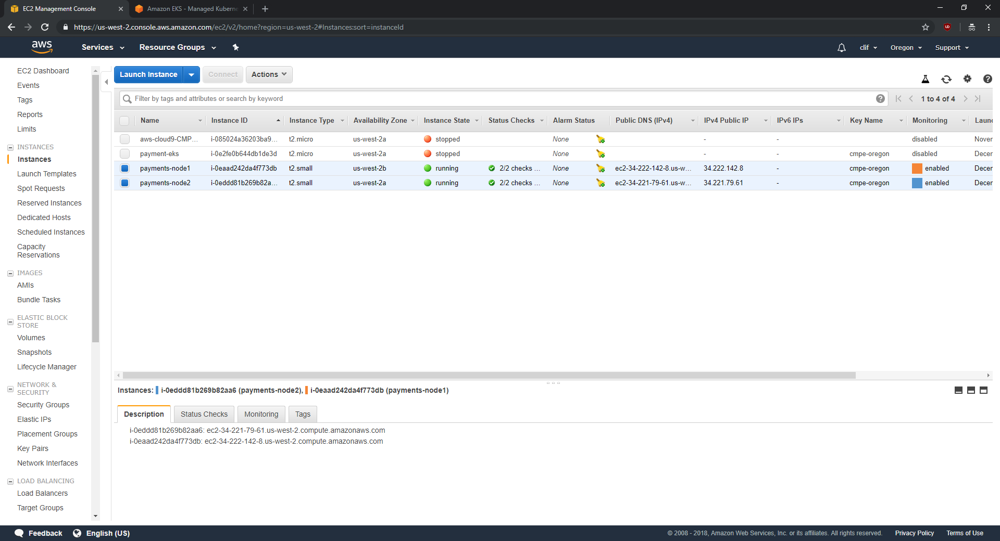
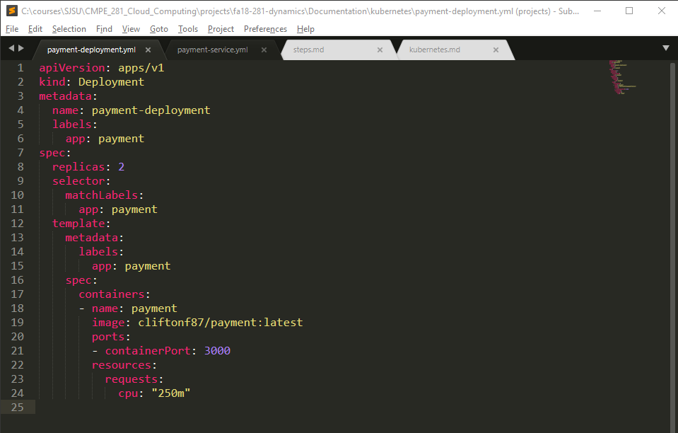
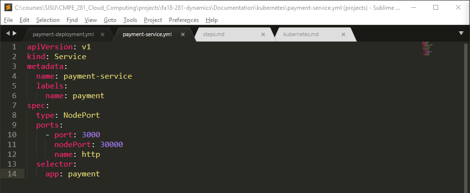
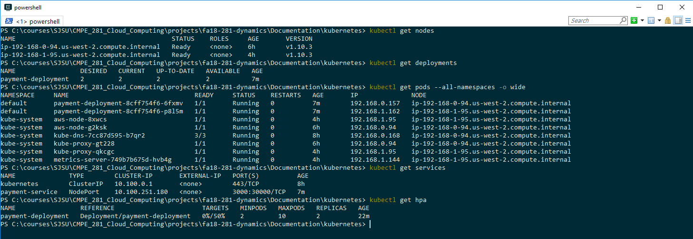

### Create EKS Role

DOC: https://docs.aws.amazon.com/eks/latest/userguide/service_IAM_role.html#create-service-role

Login to IAM console

Create a new role

- Select EKS
- Allows Amazon EKS to manage your clusters on your behalf
- Click next until you get to review
  - Add a unique name for the role "eksServiceRole"


### Create new VPC

EKS requires at least two subnets

Each has to be in different AZ's

Public subnet eks1 - 192.168.0.0/24 - usw2-az2

Public subnet eks1 - 192.168.1.0/24 - usw2-az1


Setup VPC Peering connection to N california

Edit route tables to include routes on both ends for api/db communication


## Create cluster





DOC: https://docs.aws.amazon.com/eks/latest/userguide/getting-started.html

Install aws cli

install aws-iam-authenticator

```
PS> aws configure
- Enter credentials
- Region name: us-west-2
- dont' enter anything for output format

PS> aws eks update-kubeconfig --name payments
```


Open the AWS Cloud Formation console at [https://console.aws.amazon.com/cloudformation](https://console.aws.amazon.com/cloudformation/)

Create stack

- Use Amazon s3 template URL
  - https://amazon-eks.s3-us-west-2.amazonaws.com/cloudformation/2018-11-07/amazon-eks-nodegroup.yaml

- Use node image: ami-0f54a2f7d2e9c88b3
- Subscribe to required AMI (no need for GPU support)






## EC2 Instances (Worker Nodes)



Apply configuration

```
$ kubectl apply -f aws-auth-cm.yaml
```

Verify we are connected to our instances

```
$ kubectl get nodes
```

Payment Deployment



Payment Service



```
$ kubectl get deployments
$ kubectl get services
```

Deploy metrics-server

```
PS> git clone https://github.com/kubernetes-incubator/metrics-server.git
PS> kubectl create -f deploy/1.8+/
```

Full config

```
PS> kubectl get nodes
PS> kubectl get deployments
PS> kubectl get pods --all-namespaces -o wide
PS> kubectl get services
PS> kubectl get hpa
```


