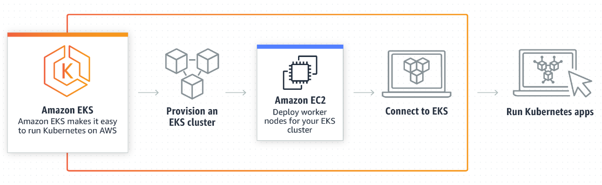

## Team Dynamics

Team Hackathon Project repository for Fall 2018 CMPE 281 course in SJSU with professor Paul Nguyen.

## Architecture

## Team Members

- [Shivam Waghela](https://github.com/shivamwaghela)
- [Clifton Francis](https://github.com/clif)
- [Ujjval Soni](https://github.com/ujjvalsoni)
- [Pavan Kumar Shekar](https://github.com/pavankumarshekar)
- [Prajwal Venkatesh](https://github.com/prajwalv)

The repo has the following structure:

- documentation - All project documentation, weekly meetings, progress and diagrams
- APIs - Go API source code
- frontend - React source code

## Steps to Run the App

Go to the frontend directory

    cd frontend

Install all the required packages

    npm install

Run the React Server

    npm start

Technologies used: ReactJS, Go, Riak KV database, MongoDB database, AWS , Heroku.

## EKS

EKS Cluster

- 2 worker nodes
- Payment deployment
  - Creates 2 replicas of payment API containers
  - Requests limit set to 250m (1/4 of a logical core)
- Payment Service
  - Exposes our deployment using a NodePort
- Metrics-server deployed to monitor pod resource utilization
- Horizontal Pod Autoscaler used to scale pods based on cpu utilization
  - New pods will spawn when pod reaches 50% cpu utilization of request limit
  - Mininum number of pods: 2
  - Maximum number of pods: 8
  
  
  ## Website screenshots
  
 
 
 
 
 
 
 
 
 
 
  
